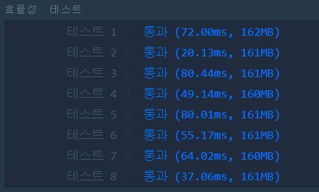

[문제링크](https://programmers.co.kr/learn/courses/30/lessons/42891)


효율성과 정확성을 따로 채점하는 특이한 문제다.

가장 먼저 원형 큐를 만들어서 시뮬레이션하는 방법을 생각해볼 수 있으나, 이렇게 풀면 큰 사이즈의 테스트케이스를 감당하지 못한다.

어떤 접시가 비워질 때마다 몇 주차를 돌았고, 그 주차마다 몇개의 접시를 돌아야되는지 블록으로 묶어서 계산해야 주어진 시간 안에 풀 수 있다. 처음부터 이렇게 했으나, 해당 주차들을 돌 때마다 info를 수정했더니 실패했다. 이유는 시간복잡도가 O(n^2)이 나왔기 때문. 
수정하지 않고 참조만 하는 식으로 코드를 변경하고나서야 비로소 모든 테스트케이스를 통과할 수 있었다.

이 때의 시간복잡도는 sort가 결정한다(O(nlogn)). 만약 접시에 담긴 음식의 양이 작았다면 counting sort를 쓰는 것이 더 빨랐을 것이고 문제의 시간복잡도도 O(n)으로 줄었을 것이다.

문제 자체는 평이했으나, 시험에서 알맞은 시간 내에 풀기에는 아직 좀 더 훈련이 필요함을 느낀다.

__놀라운 결과를 발견했다.(정답 아래에...)__


### 정답

```python
def solution(food_times, k):
    if sum(food_times) <= k: return -1
    info = food_times[:]
    info.sort(reverse = True)
    
    trans = []      # 각 요소는 (돌아야 되는 주차, 해당 접시 갯수)를 의미한다.
    cycle = 0
    for i in range(len(food_times)-1, -1, -1):
        if cycle == info[i]: continue
        cycle = info[i]
        trans.append([info[i], i+1])
        
    for i in range(len(trans)-2, -1, -1):
        trans[i+1][0] -= trans[i][0]
        
    #이제 trans를 돌며 k를 최대한 줄인다. cycle 횟수도 저장
    cycle = 0
    for i in range(len(trans)):
        temp = trans[i][0]*trans[i][1]
        if temp > k: break
        k -= temp
        cycle += trans[i][0]
        
    a, k = divmod(k, trans[i][1])
    cycle += a
    
    # 원본을 돌며, cycle보다 큰 것만 센다.
    for i in range(len(food_times)):
        if food_times[i] <= cycle: continue
        if k == 0: break
        k -= 1
        
    return i+1
```


위의 알고리즘에는 한 가지 아쉬운 점이 있다. k가 아주 작아서 회전을 몇 번 안 도는 경우에도, trans 배열(몇번째 회전만에 몇개의 접시가 다 비워지는지 나타내는 배열)을 끝까지 다 구해야 한다는 점이다.

나는 여기서 제너레이터를 생각해냈다. 실행결과는 다음과 같았다.

#### 제너레이터 사용시



#### 제너레이터 미사용시


최소 1.5배가량, 최대 3배 가량의 실행속도 차이를 보인 것이다. 이것은 상당히 의외였다. 어차피 trans를 구하는 과정의 시간복잡도는 O(n)이고, 전체의 시간복잡도는 정렬이 O(nlogn)으로 결정하기 때문이다.

이렇게 된 이유는 정렬 함수가 built_in 함수라 저 시간복잡도가 무색할 정도로 매우 빠르게 실행되기 때문이라고 밖에는 달리 설명할 수가 없는 것 같다.

어쨌든 제너레이터를 코딩문제에 처음으로 적용해본 좋은 경험이었다.


### 정답(제너레이터 사용)

```python
def transpose(info):
    trans = []
    cycle = 0
    for i in range(len(info) - 1, -1, -1):
        if cycle == info[i]: continue
        cycle = info[i]
        yield [info[i], i+1] #[ 비울때까지 돌아야 되는 사이클, 그때 다 비워지는 그릇의 갯수(누적)]

def solution(food_times, k):
    if sum(food_times) <= k: return -1
    info = food_times[:]
    info.sort(reverse=True)

    trans = transpose(info)
    # 이제 trans를 돌며 k를 최대한 줄인다. cycle 횟수도 저장
    cycle = 0
    while True:
        height, num = next(trans)
        height -= cycle
        temp = height*num
        if temp > k: break
        k -= temp
        cycle += height

    a, k = divmod(k, num)
    cycle += a

    # 원본을 돌며, cycle보다 큰 것만 센다.
    for i in range(len(food_times)):
        if food_times[i] <= cycle: continue
        if k == 0: break
        k -= 1

    return i + 1
```

