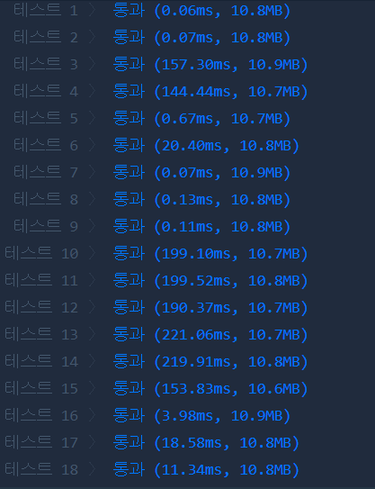

[문제링크](https://programmers.co.kr/learn/courses/30/lessons/60062)

#### 전반적인 감상

정답률 0.6%였던 문제. 그런데 풀어보니 실제 난이도는 그에 미치지 못하는 것 같다. 아마 후반부의 문제라 시간부족으로 못 푼 경우가 많지 않았을까 한다.

문제의 해결 자체는 어렵지 않지만 초반에 문제를 분석하는 과정에서 꽤 헷갈렸다. 이 문제는 기본적으로 완전탐색 문제인데 그리디 알고리즘으로 풀어야 할 것 같은 느낌이 들기 때문이다. 이전 문제에서 시간복잡도가 커서 막혔던지라 지레 겁먹고 완전탐색을 끝까지 부정한 것이 화근이었다...

입력 사이즈가 클 경우 시간복잡도를 신중하게 고민하며 따져봐야 하는 태도도 필요하지만, 반대로 작다면 길게 고민하지 말고 브루트포스를 채택하는 과감함도 필요하다는 교훈을 얻었다. (실제 시험 시간에 그리디 알고리즘의 타당성 따위를 증명하고 있을 시간은 당연히 없을 것이다.)


#### 문제 분석

다음과 같은 명제는 모두 잘못이다.

- 달리기가 빠른 사람 순으로 정렬하여, 빠른 사람 순서대로 차곡차곡 배치한다. 

  - 이유: 외벽 막판에 오밀조밀 모여있는 취약지점들이 길게 줄지어 있다면 빠른 사람이 뒤에 쓰여야 한다.

- 가장 긴 취약지점간격을 최대한 피해야 하므로, 그 종료지점부터 완전탐색을 해나가면 된다. 

  - 이유: 그 가장 긴 구간을 한 명의 사람이 완전히 커버해야 되는 경우도 생긴다. 그 경우 그 종료지점은 새로운 사람의 시작점이 아닐 수도 있다.

  

특히 마지막 명제는 매우 그럴듯하게 보인다.. 반례를 찾아내기까지 시간이 꽤 걸렸던 것 같다. 

경우의 수를 줄이기 위해 다음과 같은 사실에 착안했다.

- 모든 사람은 취약지점에서 시작하는 것이 무조건 유리하므로 그 경우만 생각한다. 국소적으로 그리디 알고리즘을 적용한 셈이다.
- 해가 여럿 있을 때, 그 중에 가장 빠른 사람을 포함하는 해는 반드시 존재한다(자명). 그리고 그 가장 빠른 사람은 반드시 취약지점에서 시작할 텐데, 그 지점을 그 해의 시작점이라고 생각할 수 있다. 따라서 모든 시작점들을 놓고 완전탐색을 할 때, 가장 빠른 사람으로 시작하는 경우만 생각하면 된다.


#### 해결하기까지

DFS와 BFS 두 가지 방식으로 풀어보았다. 

전체 실행시간을 비교해 보면 BFS가 2배 가량 빠르다. 최소를 구하는 문제라 역시 BFS가 빠른 것 같다.

전역에서 생성된 변수는 함수에서 매개변수로 받지 않아도 얼마든지 참조가 가능한데, Programmers의 문제는 함수를 정의하는 형태라 외부의 함수가 참조하게 하려면 global을 일일히 명시해야만 한다. 헤매다가 새로운 함수를 solution함수 내부에서 정의하면 간단하게 해결되는 문제라는 사실을 깨달았다.... 

queue에 넣을 정보를 간략하게 하기 위해 **비트마스크**를 활용했다. 


#### DFS(좌) VS BFS(우)

 


### 정답(재귀함수를 이용한 DFS)

```python
def solution(n, weak, dist):
    '''모든 시작점에서 검사해야한다. 가장 큰 녀석을 때려박고 시작한다.'''
    if not weak: return 0
    dist.sort(reverse=True)
    big = dist[0]				#가장 빠른 선수의 이동거리
    dist.pop(0)					#가장 빠른 선수는 무조건 처음에 깔고 시작하므로 제외한다.
    manNum = len(dist)
    visit = [0]*manNum
    
    caseNum = len(weak)
    cases = [weak]					#내부의 요소, 각 case들은 시작점으로 구분되어 있다.
    for _ in range(caseNum - 1):
        new = cases[-1][:]
        new.append(new[0]+n)
        new.pop(0)
        cases.append(new)
    
    def search(case, idx, accum):       
        '''case는 외벽의 정보, idx는 시작할 위치, accum은 지금까지 사용된 인원'''
        if accum == manNum+1: return float('inf')  
        ans = float('inf')
        for i in range(manNum):
            if visit[i]: continue
            for j in range(idx+1, len(case)):
                if case[j] - case[idx] > dist[i]: break
            else: return accum+1
            visit[i] = 1
            ans = min(ans, search(case, j, accum+1))
            visit[i] = 0
        return ans
    
    ans = float('inf')
    for case in cases:
        for idx in range(caseNum):
            if case[idx] - case[0] > big: break
        else: return 1
        ans = min(ans, search(case, idx, 1))  
        # idx는 탐색을 시작해야 할 시작 위치, 1은 big을 우겨 넣었으므로..
    
    return ans if ans != float('inf') else -1
```


### 정답(bitmask와 deque를 이용한 BFS)

```python
from collections import deque

def solution(n, weak, dist):
    '''모든 시작점에서 검사해야한다. 가장 큰 녀석을 때려박고 시작한다.'''
    if not weak: return 0
    dist.sort(reverse=True)
    BIG = dist[0]
    dist.pop(0)
    manNum = len(dist)
    
    caseNum = len(weak)
    cases = [weak]
    for _ in range(caseNum - 1):
        new = cases[-1][:]
        new.append(new[0]+n)
        new.pop(0)
        cases.append(new)
        
    queue = deque()           		#덱의 각 요소는 (어느case인가, 어디부터 진행할 것인가, 쓴 선수의 bit)
    for i, case in enumerate(cases):
        for idx in range(caseNum):
            if case[idx] - case[0] > BIG: break
        else: return 1
        queue.append((i, idx, 0))
        
    while queue:
        i, idx, bits = queue.popleft()
        for bit in range(manNum):			# bit는 dist의 몇번 선수인지를 나타냄
            if (1<<bit) & bits: continue
            for j in range(idx+1, caseNum):
                if cases[i][j] - cases[i][idx] > dist[bit]: break
            else: return bin(bits).count('1') + 2
            queue.append((i, j, bits|(1<<bit)))
                
    else: return -1
 
```

